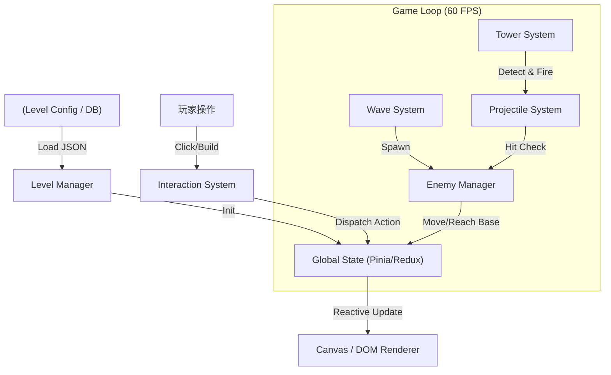

# DDoS Defender

**《DDoS Defender - Full Product Specification v2.0》**

> A tower defense game with a cybersecurity theme. Defend your origin server from DDoS attacks by strategically placing defense towers.

**Project Status**: 🚀 Full Product Development (MVP Complete ✅)

-----

## 1. Design Philosophy & Core Decisions

  * **Architecture**: Modular design with extensibility for future features
  * **Map System**: 2D grid-based system with JSON-driven layouts
  * **Wave System**: Configuration-driven with support for complex spawn patterns
  * **Progression**: Tower upgrades, experience system, and player skill development
  * **Extensibility**:
      * **Multiplayer**: State/View separation enables WebSocket synchronization
      * **Status Effects**: Interface supports tower disables, enemy slows, and future effects
      * **Content**: JSON-driven enemies, towers, and waves for easy balancing

-----

## 📚 Documentation

- **[Game Design](docs/design/game-flow.md)**: Complete game flow and mechanics
- **[Enemy Stats](docs/specs/enemy-stats.md)**: All enemy types and specifications
- **[Tower Stats](docs/specs/tower-stats.md)**: All tower types and upgrade paths  
- **[Wave Config](docs/specs/wave-config.md)**: Wave progression and balance design
- **[Development Roadmap](docs/DEVELOPMENT_ROADMAP.md)**: Development progress tracking

-----

## 2. Game Features

### 🎮 Current Features (MVP Complete)
- ✅ 4 Tower Types (RATE_LIMIT, WAF, DPI, CACHE)
- ✅ 4 Enemy Types (REQ_STD, REQ_HEAVY, REQ_STREAM, ZERO_DAY Boss)
- ✅ Wave-based gameplay with JSON configuration
- ✅ Tower targeting and projectile system
- ✅ Status effects (Slow, Tower Disable)
- ✅ Boss mechanics (Blackout skill)
- ✅ Victory/Game Over conditions

### 🚧 In Development (Phases 7-13)
- 🔄 **Enhanced Wave System**: Multi-enemy spawning, wave transitions, bonus rewards
- 🔄 **Tower Upgrades**: Experience system, level progression, stat increases
- 📋 **Special Towers**: CODE_FARMER (income), SUPERVISOR (attack speed), SA (range)
- 📋 **Tower Management**: Sell towers, info panel, buff calculations
- 📋 **UI/UX**: Main menu, pause system, game speed control, settings
- 📋 **Audio**: Background music and sound effects
- 📋 **Testing**: Unit tests, integration tests, TDD approach

### 🎯 Planned Features (Post-Launch)
- Save/Load system
- Daily challenges
- Achievements
- Leaderboards  
- Multiple maps
- Custom wave editor

-----

## 3. Entity Mapping (Tech Theme)

Game elements mapped to cybersecurity concepts:

| Category | Code | Name | Concept | Description |
| :--- | :--- | :--- | :--- | :--- |
| **Core** | `Origin` | **Origin Server** | Base | HP = Server Availability. 0 HP = 503 Error. |
| **Enemy** | `Req_Std` | **HTTP Request** | Basic | Standard attack and speed. |
| **Enemy** | `Req_Heavy` | **Large Payload** | Tank | Slow but high HP. `POST /upload` |
| **Enemy** | `Req_Stream` | **Socket Flood** | Fast | Low HP, very fast. `WebSocket` spam. |
| **BOSS** | `ZeroDay` | **Zero-Day Exploit** | Boss | **Blackout** skill: Disables towers for 5s. |
| **Tower** | `RateLimit` | **Rate Limiter** | Basic | Single target, fast fire rate. |
| **Tower** | `WAF` | **WAF Node** | AOE | Area damage for swarms. |
| **Tower** | `DPI` | **DPI Scanner** | Sniper | Slow fire, massive damage. |
| **Tower** | `Cache` | **Redis Cache** | Slow | Applies 50% slow debuff. |
| **Tower** | `CodeFarmer` | **碼農** | Economy | Passive gold income. |
| **Tower** | `Supervisor` | **主管** | Buff | Increases nearby tower attack speed. |
| **Tower** | `SA` | **System Analyst** | Buff | Increases nearby tower range. |

-----

## 3. 系統架構設計 (Architecture Design)

我們採用 **ECS (Entity-Component-System)** 的變體，適合前端開發。

### 3.1 資料流向圖



### 3.2 核心模組職責

1.  **`GridManager` (地圖管理者):**

      * 維護一個二維陣列 `grid[y][x]`。
      * 每個格子儲存狀態：`{ type: 'EMPTY' | 'WALL' | 'PATH' | 'TOWER', towerId: string | null }`。
      * **MVP 實作：** 寫死路徑座標陣列 `pathCoordinates = [{x:0, y:2}, {x:1, y:2}...]` 供敵人移動使用。
      * **未來擴充：** 若切換模式，將 `pathCoordinates` 改為由 A\* 演算法動態計算。

2.  **`WaveManager` (波數控制器):**

      * 負責解析關卡設定檔。
      * 計時器邏輯：`Next wave in 10s...`。
      * 生成邏輯：根據設定檔的 `spawnInterval` 觸發敵人生成事件。

3.  **`TowerSystem` (防禦塔系統):**

      * **索敵 (Targeting)：** 計算 `distance(tower, enemy)`。
      * **策略：** 支援 `First` (打最前面的), `Strongest` (打血最多的), `Close` (打最近的)。
      * **狀態機：** 塔也有狀態 `IDLE` | `ATTACKING` | `OFFLINE` (被 Boss 斷電時)。

-----

## 4. 資料結構定義 (Data Structures)

定義好 JSON 結構，這也是你資料庫將來要存的格式。

### 4.1 關卡設定檔 (`LevelConfig.json`)

這設計允許你隨時調整平衡，甚至做成後台讓非技術人員調整。

```json
{
  "levelId": 1,
  "mapWidth": 20,
  "mapHeight": 12,
  "initialResources": 500,
  "mapLayout": [
    [0, 0, 0, 1, 1, 1, 0, ...], 
    // 0: 可建築空地, 1: 固定路徑(封包光纖)
  ],
  "waves": [
    {
      "waveId": 1,
      "enemyType": "REQ_STD",
      "count": 10,
      "spawnInterval": 1000, // 毫秒
      "delayBeforeWave": 0
    },
    {
      "waveId": 2,
      "enemyType": "REQ_STREAM", // WebSocket flood
      "count": 20,
      "spawnInterval": 300, // 密集生成
      "delayBeforeWave": 5000
    },
    {
      "waveId": 5, // Boss Wave
      "enemyType": "ZERO_DAY_BOSS",
      "count": 1,
      "bossSkill": "BLACKOUT"
    }
  ]
}
```

### 4.2 敵人實體 (`EnemyEntity`)

```typescript
interface Enemy {
  id: string;
  type: 'REQ_STD' | 'REQ_HEAVY' | 'REQ_STREAM' | 'ZERO_DAY';
  hp: number;
  maxHp: number;
  speed: number; // 格子/秒
  
  // 路徑控制
  pathIndex: number; // 目前走到路徑陣列的第幾個索引
  position: { x: number, y: number }; // 精確像素座標
  
  // 狀態效果 (未來擴充)
  status: {
    isSlowed: boolean;
    slowFactor: number; // 0.5 代表緩速 50%
  };
}
```

-----

## 5. 執行流程與階段規劃 (Implementation Roadmap)

我們依據 MVP 原則，切分為三個 Sprint。

### **Phase 1: 基礎建設 (The Skeleton)**

  * **目標：** 畫出地圖，讓一個紅點（敵人）沿著線走到底，扣除基地血量。
  * **任務：**
    1.  搭建 Vue 3 + Canvas 專案環境。
    2.  實作 `GridManager` 渲染靜態的網格地圖。
    3.  實作 `EnemyManager`，讀取寫死的路徑陣列，讓方塊移動。
    4.  實作基本的 Game Loop (`requestAnimationFrame`)。

### **Phase 2: 武裝與防禦 (The Gameplay)**

  * **目標：** 可以點擊地圖放置塔，塔會發射子彈消滅敵人。
  * **任務：**
    1.  實作 `InteractionManager`：點擊網格 -\> 扣錢 -\> 放置塔。
    2.  實作 `TowerSystem`：簡單的距離偵測 (`Math.hypot`) 與射擊冷卻 (`Cooldown`)。
    3.  實作子彈飛行與碰撞檢測 (AABB 碰撞或距離判定)。
    4.  UI 介面：顯示金錢、波數、HP。

### **Phase 3: 內容與變數 (The Content)**

  * **目標：** 引入不同類型的敵人與塔，以及波數邏輯。
  * **任務：**
    1.  實作 `WaveManager` 解析 JSON 設定檔。
    2.  加入 **Req\_Heavy (坦克)** 與 **Req\_Stream (快攻)** 敵人參數。
    3.  加入 **AOE (WAF)** 與 **緩速 (Redis)** 效果邏輯。
    4.  製作簡單的結算畫面 (Game Over / Victory)。

-----

## 6. 架構師的特別叮嚀 (Architect's Notes)

1.  **關於座標系統：**
      * 請嚴格區分 **Grid 座標** (例如 x: 5, y: 3) 與 **Canvas 畫布座標** (例如 x: 320px, y: 192px)。
      * 邏輯運算盡量用 Grid 座標，只有在渲染 (`draw()`) 時才乘上 `CELL_SIZE` 轉為畫布座標。這樣未來做 RWD 或縮放地圖時會很輕鬆。
2.  **關於效能 (WebSocket Flood)：**
      * 當畫面上有 200+ 個「WebSocket 敵人」時，Vue 的 Reactivity 可能會造成效能瓶頸。
      * **建議：** 敵人列表 (`enemies array`) **不要** 用 Vue 的 `ref/reactive` 深層監聽，或者使用 `shallowRef`。這部分資料變化太快，直接在 Game Loop 中操作普通 JS Array，只在 UI 顯示數量時才通知 Vue 更新。
3.  **關於連線預備：**
      * 雖然現在是單機，但請保持 `GameState` 純淨。不要把 UI 元件 (DOM Elements) 存進 State 裡。只要 State 是純 JSON 物件，未來就可以透過 Socket 傳送給另一個玩家實現同步。
