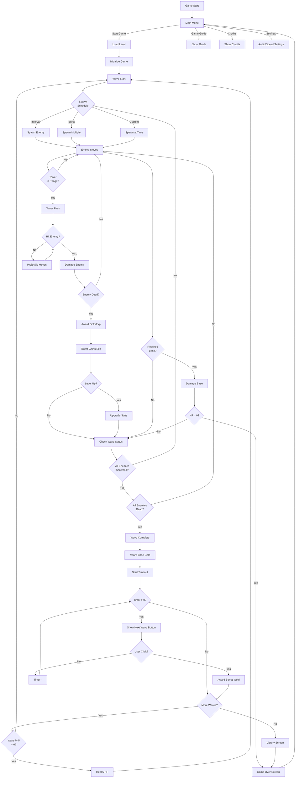
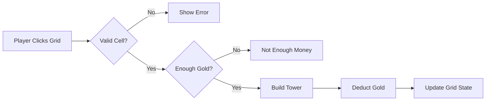
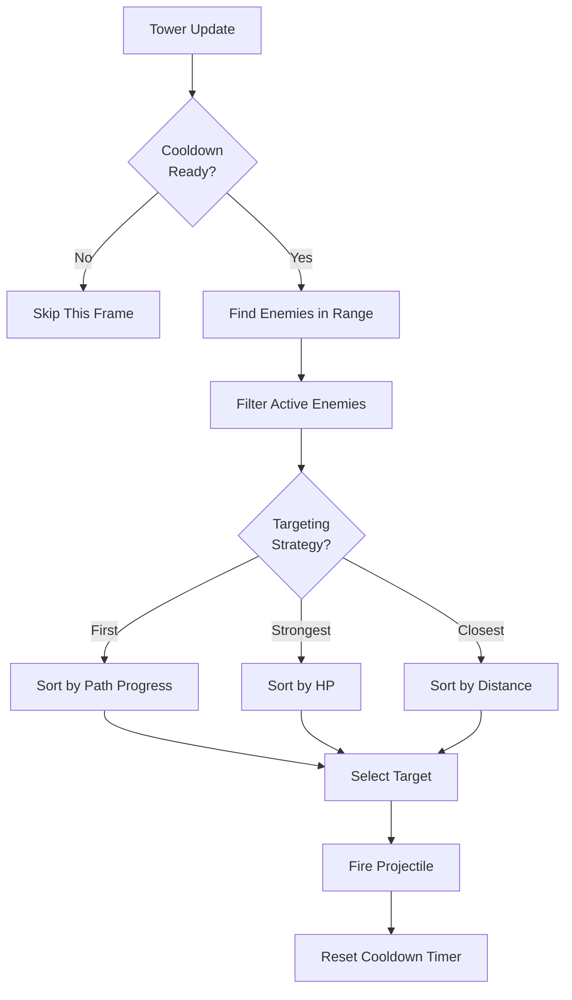
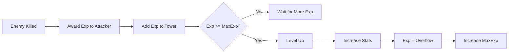
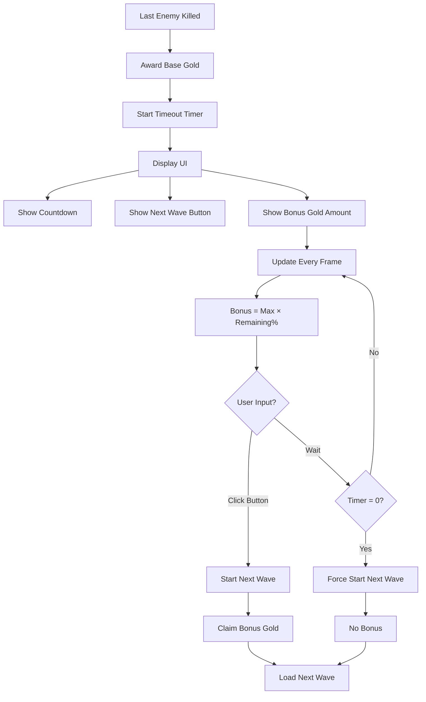
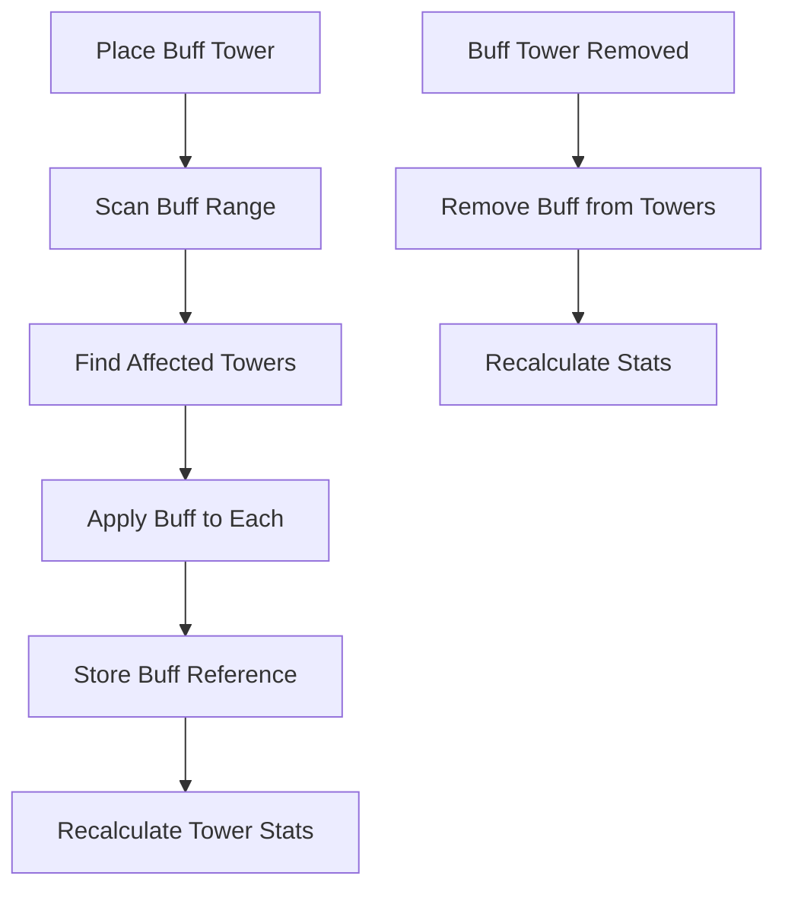
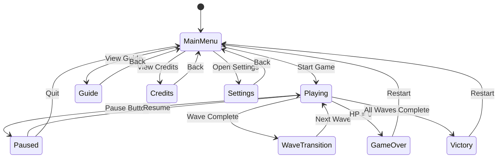

# Game Flow & Mechanics

## Overview
This document describes the complete game flow, core mechanics, and systems in DDoS Defender.

---

## Game Flow Diagram



---

## Core Mechanics

### 1. Tower Placement



**Rules**:
- Can only build on `EMPTY` cells
- Cannot build on `PATH` or `BLOCKED` cells
- Must have sufficient gold
- Grid cell becomes `TOWER` type

---

### 2. Tower Targeting



**Targeting Strategies**:
- **First**: Enemy furthest along path (default)
- **Strongest**: Enemy with highest current HP (DPI)
- **Closest**: Enemy nearest to tower

---

### 3. Experience & Leveling



**Level Up Benefits**:
- Damage: +5%
- Range: +2%
- Cooldown: -3%
- Visual indicator (glow effect)

**MaxExp Formula**: `50 × level^1.5`

---

### 4. Wave Transition



**Bonus Formula**: 
```typescript
const bonusRatio = remainingTime / totalTimeout;
const actualBonus = Math.floor(maxBonus * bonusRatio);
```

---

### 5. Buff Tower System



**Buff Stacking**:
- Same buff from multiple sources: Additive up to 2 stacks
- Different buffs: Fully stackable
- Example: 2 Supervisors = +40% attack speed

---

## Game States

### State Machine



---

## User Interface Layout

### In-Game HUD

```
┌─────────────────────────────────────────────┐
│ Gold: 500  HP: 80/100  Wave: 5/30           │ <- Top Bar
├─────────────────────────────────────────────┤
│                                             │
│                                             │
│           [Game Canvas]                     │
│                                             │
│                                             │
├─────────────────────────────────────────────┤
│ [Rate Limit] [WAF] [DPI] [Cache]           │ <- Tower Selection
│    100g      200g   300g   150g             │
└─────────────────────────────────────────────┘

Buttons (floating):
├─ [⏸ Pause] (top-right)
├─ [⏩ Speed: x2] (top-right)
└─ [🔊 Audio] (top-right)
```

### Tower Info Panel (on tower click)

```
┌─────────────────────────┐
│   RATE_LIMIT Tower      │
│                         │
│   Level: 3              │
│   Exp: 120/300          │
│   ━━━━━━━━░░░░ 40%      │
│                         │
│   Damage: 22            │
│   Range: 3.1 cells      │
│   Cooldown: 470ms       │
│                         │
│   Sell Value: 157g      │
│                         │
│   [Sell Tower]          │
└─────────────────────────┘
```

### Wave Transition Overlay

```
┌─────────────────────────┐
│   Wave 5 Complete!      │
│                         │
│   Base Reward: +100g    │
│                         │
│   Next wave in: 23s     │
│   Bonus: +82g           │
│                         │
│   [Start Next Wave]     │
└─────────────────────────┘
```

---

## Audio Design

### Sound Effects
| Event | Sound | Volume | Priority |
|-------|-------|--------|----------|
| Tower Build | Click + Confirmation | 70% | Medium |
| Tower Fire | Pew/Shot | 40% | Low |
| Enemy Death | Pop/Explode | 60% | Low |
| Wave Complete | Victory Chime | 80% | High |
| Boss Spawn | Dramatic Stinger | 90% | High |
| Game Over | Sad Trombone | 80% | High |
| Level Up | Power Up | 70% | Medium |

### Background Music
- **Main Menu**: Calm techno loop
- **Gameplay**: Upbeat electronic battle music
- **Boss Wave**: Intense orchestral track
- **Victory**: Triumphant fanfare

---

## Performance Considerations

### Optimization Strategies
1. **Object Pooling**: Reuse enemy/projectile objects
2. **Spatial Partitioning**: Grid-based collision detection
3. **Dirty Flags**: Only recalculate buffs when towers change
4. **Request Animation Frame**: Smooth 60 FPS
5. **Canvas Layering**: Separate static/dynamic elements

### Target Performance
- **60 FPS**: With 100+ enemies and 20+ towers
- **Memory**: < 100MB total
- **Load Time**: < 2 seconds

---

## Testing Strategy

### Unit Tests
- Grid coordinate conversion
- Tower targeting logic
- Experience calculations
- Wave progression
- Buff stacking

### Integration Tests
- Tower placement flow
- Enemy spawn timing
- Wave transition
- Audio playback

### E2E Tests
- Complete wave 1-10
- Boss defeat
- Tower upgrade
- Game over scenario
- Victory condition

---

## Accessibility Features

### Planned Accessibility
- [ ] Colorblind mode (alternative visual indicators)
- [ ] Keyboard shortcuts (space = pause, 1-4 = tower select)
- [ ] Scalable UI (text size options)
- [ ] Screen reader support (for menus)
- [ ] Reduced motion mode (disable particles)

---

## Future Enhancements

### Post-Launch Features
1. **Save/Load System**: Persist progress
2. **Daily Challenges**: Special wave compositions
3. **Achievements**: Unlock new towers/skins
4. **Leaderboards**: Compete for high scores
5. **Multiple Maps**: Different paths/difficulties
6. **Custom Waves**: Player-created content
